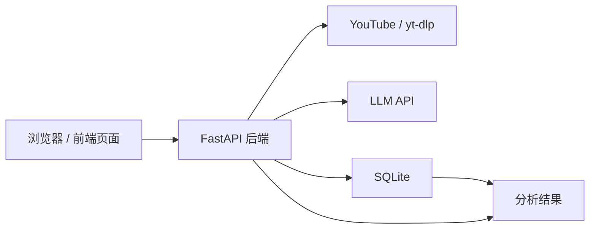
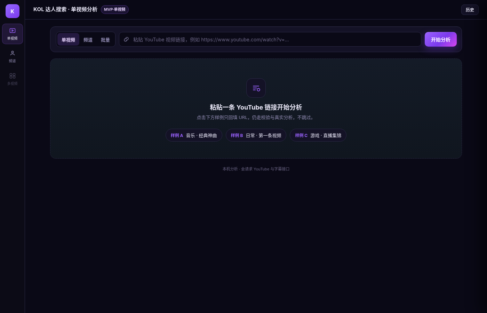
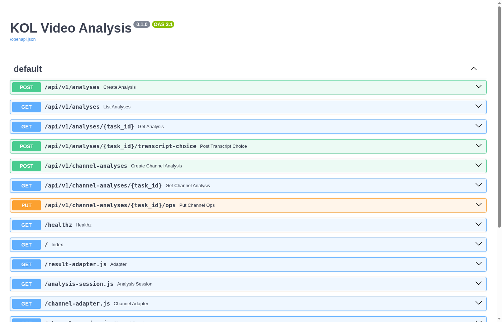

# KOL 达人视频分析（kol_analyse）

基于 FastAPI 的 YouTube / KOL 内容分析工具：输入视频或频道链接，自动拉取内容与评论，完成结构化拆解与情感分析，并在前端展示结果。

适合作为简历项目查看：**后端 API + 前端页面** 完整可运行快照（不含密钥与本地数据库）。

## 功能

- 支持 YouTube 视频 URL 分析（元数据 / 字幕 / 评论）
- LLM 结构化内容拆解与评论情感分析
- 异步任务状态跟踪与错误码
- 支持频道抽样分析（最近 / 热门视频简报，视配置开启）

## 技术栈

- 后端：Python · FastAPI · Uvicorn · SQLite
- 前端：原生 HTML / JavaScript
- 外部能力：LLM API · YouTube Data API / yt-dlp（密钥通过环境变量注入）

## 快速开始

1. 复制环境变量模板并填写密钥（**不要提交 `.env`**）

```bash
cp .env.example .env
```

2. 安装依赖

```bash
pip install -r requirements.txt
```

3. 启动后端（在 `backend` 目录）

```bash
cd backend
python -m uvicorn app.main:app --reload --host 127.0.0.1 --port 8000
```

4. 浏览器打开 `frontend/index.html`，确保页面请求的 API 地址为 `http://127.0.0.1:8000`

接口文档（服务启动后）：http://127.0.0.1:8000/docs

## 架构



数据流简述：浏览器提交视频或频道链接 → FastAPI 异步拉取 YouTube 元数据、字幕与评论 → 调用 LLM 做结构化分析 → 结果写入 SQLite，再返回前端展示。

## 运行截图





如需更新截图，将新图放入 `docs/screenshots/`，在本 README 用相对路径引用即可。

## 目录结构

```
backend/            # 分析 API、worker、prompts、测试
frontend/           # 页面与会话适配逻辑
docs/screenshots/   # 运行截图（README 相对路径引用）
.env.example        # 环境变量示例（占位符，无真实密钥）
requirements.txt
```

## 说明

- 本仓库为公开简历展示用精简拷贝，已排除 `.env`、本地数据库（`*.db`）与无关导出文件。
- `.gitignore` 已覆盖 `.env`、`*.db`、`backend/data/` 等敏感/本地产物，请勿手动强制添加。
- 运行前请自行申请并配置 LLM / YouTube 相关密钥；仓库内不含任何真实密钥。
